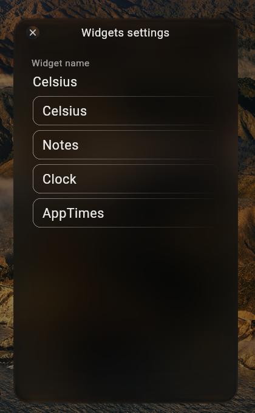
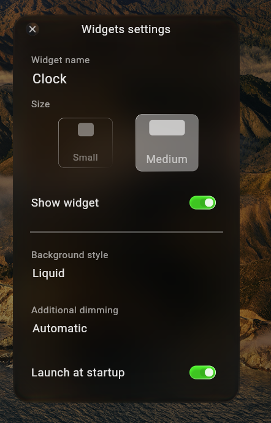
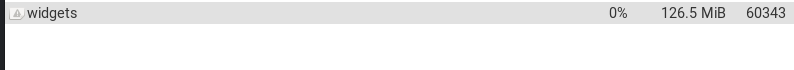
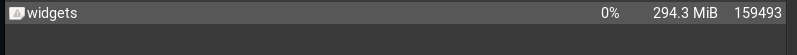

# Widgets

## A small desktop widget application for elementary OS.

https://github.com/user-attachments/assets/6a8146ad-11a1-4f0b-bc0e-1c8ca37ae90e


## Features:
#### - Notes
#### - Weather
#### - Screen Time
#### - Clock


<p align="center">
  
  
</p>

## Technology:
#### Built with Kotlin Multiplatform, targeting the JVM for the desktop application.


## Technical Details:
#### -Uses the built-in GeoClue service for automatic location detection.
#### -Runs as a desktop overlay while providing native desktop functionality, including window movement with the right mouse button (RMB).
#### -Screen time data is read from the system journal, while application usage times are collected and processed by the widget.
#### -ImageMagick is required for background effects and is installed automatically.


## System Resource Usage:
#### -RAM: ~100–350 MB, depending on widget activity and JVM Garbage Collector behavior. Memory usage is typically around 250 MB after startup, may temporarily increase during runtime, and can decrease as the JVM performs garbage collection.




#### -CPU: Low. Under normal conditions, CPU usage is typically negligible and may appear as 0% in some system monitors due to their measurement/rounding behavior.


## -Installation
#### Install the .deb package using:

```bash
sudo apt install ./widgets_1.0.0_amd64.deb
```
